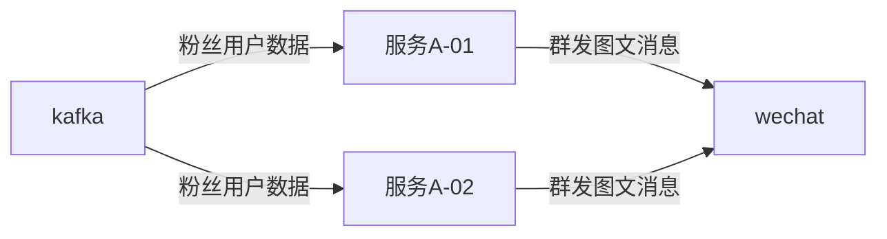

# 记录一次Kafka频繁触发再平衡问题

**{docsify-updated}**

## 1. 起因

出于业务需要，公众号图文消息粉丝推送服务A部署了2个机器节点，同属于一个消费者组，消费kafka事件（粉丝用户数据），调用微信群发图文消息接口，流程简图如下：



统计文章推送数据情况时，发现存在同一篇文章（同一个media_id）推送响应的msg_data_id是多个，导致统计数据没有聚合。微信官方文档没有对msg_data_id的生成机制做出解释，微信社区也存在[类似问题](https://developers.weixin.qq.com/community/develop/doc/000208e86a0000dd133bf153856c00)。

## 2.解决过程

猜测可能是由于两个机器节点的问题，于是改动kafka生产者，增加指定key，使同一批次推送的粉丝数据写入同一个partition，这样推送时只会在一个消费者中完成。

生产者改动后，同一批次的粉丝数据写入的key是相同的，写入了同一个partition。但是发现同一批次的粉丝数据还是被多个消费者消费到了，与理论不一致，仔细查看了系统日志，发现了出现rebalance现象。日志如下：

```text
11:15:04.278 [org.springframework.kafka.KafkaListenerEndpointContainer#0-0-C-1] WARN  o.a.k.c.c.i.ConsumerCoordinator - [Consumer clientId=consumer-2, groupId=fans-push-service] Synchronous auto-commit of offsets {fans-push-9=OffsetAndMetadata{offset=103226, metadata=''}, fans-push-0=OffsetAndMetadata{offset=135409, metadata=''}, fans-push-1=OffsetAndMetadata{offset=103491, metadata=''}, fans-push-2=OffsetAndMetadata{offset=103239, metadata=''}, fans-push-3=OffsetAndMetadata{offset=103473, metadata=''}, fans-push-4=OffsetAndMetadata{offset=103223, metadata=''}, fans-push-5=OffsetAndMetadata{offset=103229, metadata=''}, fans-push-6=OffsetAndMetadata{offset=103234, metadata=''}, fans-push-7=OffsetAndMetadata{offset=103232, metadata=''}, fans-push-8=OffsetAndMetadata{offset=103232, metadata=''}} failed: Commit cannot be completed since the group has already rebalanced and assigned the partitions to another member. This means that the time between subsequent calls to poll() was longer than the configured max.poll.interval.ms, which typically implies that the poll loop is spending too much time message processing. You can address this either by increasing the session timeout or by reducing the maximum size of batches returned in poll() with max.poll.records.
11:15:04.278 [org.springframework.kafka.KafkaListenerEndpointContainer#0-0-C-1] INFO  o.a.k.c.c.i.ConsumerCoordinator - [Consumer clientId=consumer-2, groupId=fans-push-service] Revoking previously assigned partitions [fans-push-9, fans-push-0, fans-push-1, fans-push-2, fans-push-3, fans-push-4, fans-push-5, fans-push-6, fans-push-7, fans-push-8]
11:15:04.278 [org.springframework.kafka.KafkaListenerEndpointContainer#0-0-C-1] INFO  o.s.k.l.KafkaMessageListenerContainer - partitions revoked: [fans-push-9, fans-push-0, fans-push-1, fans-push-2, fans-push-3, fans-push-4, fans-push-5, fans-push-6, fans-push-7, fans-push-8]
```

最后找到原因，由于消费者配置的参数max.poll.records=500，session.timeout.ms=10000，链路追踪监控，发现消费一条记录进行业务处理耗时1500ms，所以每次kafka poll 500条记录的话很容易导致会话超时。

在会话超时时间内，消费者若没有发送心跳包，则kafka协调节点则认为该消费已死，进行移除，从而触发再平衡重新分配partition。发送心跳包是在消费者poll时触发的，因此监控两次poll之间的业务处理耗时，设置合理的超时时间很重要。

```text
session.timeout.ms说明
The timeout used to detect consumer failures when using Kafka's group management facility. The consumer sends periodic heartbeats to indicate its liveness to the broker. If no heartbeats are received by the broker before the expiration of this session timeout, then the broker will remove this consumer from the group and initiate a rebalance. Note that the value must be in the allowable range as configured in the broker configuration by <code>group.min.session.timeout.ms</code> and <code>group.max.session.timeout.ms</code>.

heartbeat.interval.ms说明
The expected time between heartbeats to the consumer coordinator when using Kafka's group management facilities. Heartbeats are used to ensure that the consumer's session stays active and to facilitate rebalancing when new consumers join or leave the group. The value must be set lower than <code>session.timeout.ms</code>, but typically should be set no higher than 1/3 of that value. It can be adjusted even lower to control the expected time for normal rebalances.
```


调整为max.poll.records=10，session.timeout.ms=30000，heartbeat.interval.ms=10000，再次发布后问题得到解决。根据官方文档说明，心跳检测时间一般设置为会话超时时间的1/3比较合适。

kafka参数优化后，同一个key的kafka消息最终只被一个消费者消费，理论得到验证。粉丝推送同一篇文章推送出现多个msg_data_id的问题也得到了解决。

kafka再平衡还会引起消息的重复消费，如果在消费者被移除消费者组之前未及时进行commit offset，那么接管该partition的消费者就会出现重复消费，因此对kafka消费做幂等处理也很重要。