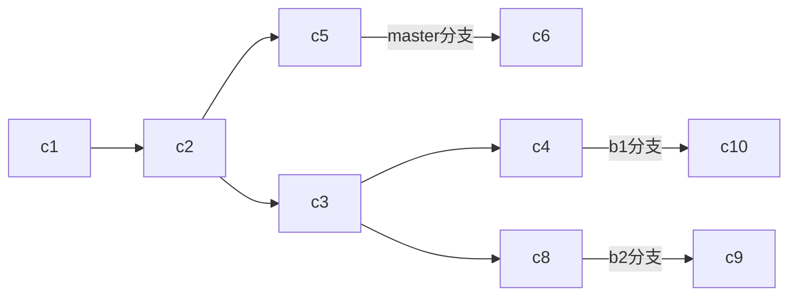
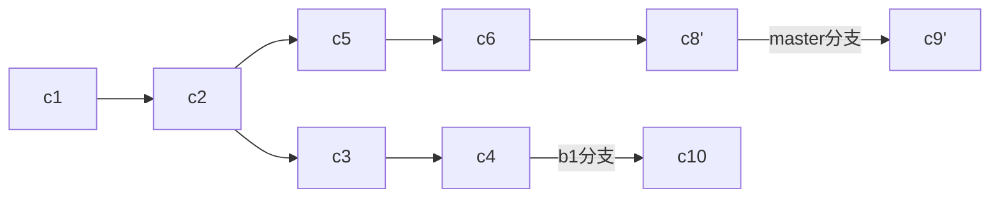
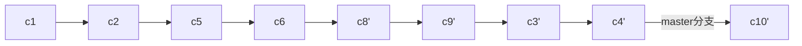

# Git

## 一、简介

Git和其它版本控制系统的主要差别在于对待数据的方法。其它版本控制系统主要以文件变更列表得到方式存储信息；GIt主要对当时的全部文件制作一个快照并保存这个快照的索引，为了高效，如果文件没有修改，Git不再重新存储该文件，而是只保留一个链接指向之前存储的文件，对待数据更像是一个快照流。 Git有三种状态：

* 已提交
* 已修改
* 已暂存

  由此，引入三个工作区域：工作区、暂存区、版本库

### 配置用户信息

```text
git config --global user.name "jack"
git config --global user.email "xxx@gmail.com"
```

### 检查配置信息

```text
git config --list
```

### 获取帮助

```text
git help <verb>
git <verb> --help
```

## 二、基础

### 初始化仓库

```text
git init
```

### 添加文件并提交至本地仓库

```text
git add .
git commit -m “xxx"

两步合并 git commit -a -m “xxx"
```

### 克隆远程仓库

```text
git clone [url]
```

### 检查当前文件状态

```text
git status
git status -s 或 git status --short 简洁输出
```

### 文件的状态变化周期：

```sequence
participant Untracked
participant Unmodified
participant Modified
participant Staged
Untracked->>Staged: Add the file
Unmodified->>Modified: Edit the file
Modified->>Staged: Stage the file
Unmodified->>Untracked: Remove the file
Staged->>Unmodified: Commit
```

忽略文件 .gitignore 格式规范：

* 所有空行或者以\#开头的行都会被git忽略
* 可以使用标准的glob模式匹配
* 匹配模式可以以 / 开头防止递归
* 匹配模式可以以 / 结尾指定目录
* 要忽略指定模式以外的文件或目录，可以在模式前加上 ！取反

  glob模式指shell所使用的简化了的正则表达式

### 比较差异

比较当前文件与暂存区快照的文件\(git add 前\)差异

```text
git diff
```

比较已暂存的文件\(git add 后\)与版本库里的文件\(git commit 前\)差异

```text
git diff --cached 或 git diff --staged
git diff 插件 git difftool
```

### 移除文件

```text
git rm 删除本地目录及其版本库
git rm --cached 删除版本库，保留本地目录
```

### 移动文件

```text
git mv 文件1 文件2 重命名
```

### 查看提交历史

```text
git log
git log -p 查看提交的内容差异
git log -2 仅显示最近2次提交
git log -stat 简略的统计信息
git log -graph 图形化
```

### 撤销操作

有时候提交完了发现漏掉几个文件没有添加，或者提交信息写错了

```text
git commit --amend 重新提交
上次提交后马上执行 git commit --amend -m “xxx” 只是修改了上次提交的
```

### 提交信息

如果提交完了发现几个文件没有添加，如下

```text
git commit -m “commit1”
git add forgotten_file
git commit --amend -m “commit2” 最终只有commit2一次提交
```

### 取消暂存的文件

```text
将暂存区中的文件修改内容撤销，就是git add之后commit之前的内容
git reset HEAD 文件名
```

### 撤销对文件的修改

```text
还原成上次提交的样子
git checkout -- 文件名
```

### 查看远程仓库

```text
git remote
```

origin 是git给你克隆的仓库服务器的默认名字

```text
git remote -v 查看名字对应的URL
```

### 添加远程仓库

```text
git remote add origin URL
```

### 从远处仓库中抓取与拉取

```text
抓取克隆或上一次抓取后新推送的所有工作
git fetch 名字  //拉取到你本地仓库，但不会自动合并或修改你当前的工作，必须手动合并

git pull //自动抓取并合并远程分支到当前分支
```

### 推送到远程仓库

```text
git push origin master //将本地master分支推送到origin服务器
```

### 查看某个远程仓库

```text
git remote show origin
```

### 远程仓库的移除与重命名

```text
git remote rename 名字1 名字2
git remote rm 名字
```

### 打标签

列出标签

```text
git tag 列出已有的标签
```

创建标签，标签主要两种类型：轻量标签、附注标签 附注标签，存储在git数据库中的一个完整对象

```text
git tag -a v0.1 -m “create tag v0.1”
git show v0.1
```

轻量标签，只是一个特定提交的引用

```text
git tag v0.2
git show v0.2
```

后期打标签，忘记了之后补上标签

```text
git tag -a v0.3 9fceb02(指定提交点的部分校验和)
```

### 共享标签，就是推送标签到远程

```text
git push origin v0.2
```

### 删除标签

```text
git tag -d v0.3. //删除本地
git push origin :refs/tags/v0.3  //删除远程
```

## 三、分支

Git的分支，其实本质上仅仅是指向提交对象的可变指针。

### 创建分支

```text
git branch 分支名
```

### 分支切换

```text
git checkout 分支名
git checkout -b 分支名 //创建分支且切换分支
```

### 合并分支

将指定分支合并到当前分支

```text
git merge 分支名
```

遇到冲突时的分支合并 如果合并时产生了冲突，此时Git做了合并，但没有自动地创建一个新的合并提交。Git会暂停下来，等待你去解决合并产生的冲突。

```text
git status  //查看那些因包含合并冲突而处于未合并状态的文件
```

这表示HEAD所指示的版本，也就是当前分支所在的位置，在这个区段的上半部分（\=\=\=\=\=的上半部分），而另一个分支iss53所指示的版本在\=\=\=\=\=的下半部分。

```text
<<<<<<< HEAD:index.html 
<div id="footer">contact : email.support@github.com</div> 
======= 
<div id="footer"> 
 please contact us at support@github.com 
</div> 
>>>>>>> iss53:index.html
```

解决冲突，去除&lt;&lt;&lt;&lt;&lt; \=\=\=\=\=\= &gt;&gt;&gt;&gt;&gt;后，git add命令来将其标记为冲突已解决。一旦暂存这些原本有冲突的文件，Git就会将它们标记为冲突已解决。再git commit完成合并提交。

### 查看当前所有分支列表

```text
git branch
git branch -v //查看每一个分支的最后一次提交
git branch --merged  //过滤这个列表中已经合并到当前分支的分支
git branch --no-merged //过滤这个列表中尚未合并到当前分支的分支
```

### 删除分支

如果包含了还未合并的工作，尝试删除分支时会失败

```text
git branch -d 分支名
```

可以强制删除

```text
git branch -D 分支名
```

### 远程分支

```text
git ls-remote (remote)  显示地获得远程引用的完整列表
git remote show (remote) 获取远程分支的更多信息
```

### 推送

```text
git push origin 本地分支名:远程分支名   推送本地分支到一个命名不相同的远程分支
```

### 跟踪分支

```text
git checkout -b 本地分支名 origin/远程分支名
git checkout --track origin/远程分支名   同上，是一种快捷操作，本地分支与远程分支命名相同

git branch -u origin/远程分支名   显式绑定远程分支
git branch -vv 查看设置的所有跟踪分支信息
```

### 拉取

```text
git fetch 拉取服务器本地没有的数据
git pull 拉取服务器本地没有的数据并且进行合并，等同于git fetch后git merge
```

### 删除远程分支

```text
git push origin —delete 本地分支名
说明：此命令只是从服务器移除这个指针，服务器通常会保留一段时间后进行垃圾回收，所以无意删除是可以恢复的
```

### 变基

使用rebase命令将提交到某一分支上的所有修改都移至另一分支上

```text
如果想将b1分支通过rebase方式合并到master分支上，则
git checkout b1 先切换到b1分支
git rebase master 将当前分支b1对比master分支，提取相对于共同祖先的历次提交，存为临时文件
git checkout master 切换到master分支
git merge b1 将之前另存为临时文件的修改依序应用，进行合并
```

一般这样做的目的是为了确保向远程分支推送时能保持提交历史的整洁



如果希望将b2中的修改合并到主分支，但暂时不想合并b1分支中的修改

```text
git rebase --onto master b1 b2  取出b2分支，找出处于b2分支和b1分支的共同祖先c3之后的修改，然后把它们在master分支上重放一遍
git checkout master
git merge b2
```



然后再将b1分支合并到master分支

```text
git rebase master b1 直接将b1分支变基到master分支，等同于git checkout b1再git rebase master
git checkout master
git merge b1
```



**风险：不要对在你的仓库外有副本的分支执行变基。**

