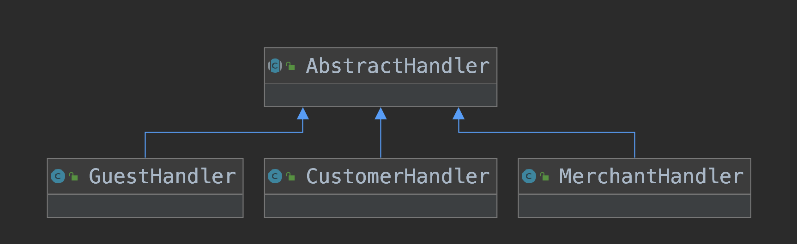

# 设计模式-职责链模式

**{docsify-updated}**

## 一、定义

职责链模式：使多个对象都有机会处理请求，从而避免请求的发送者和接受者之间的耦合关系。将这个对象连成一条链，并沿着这条链传递该请求，直到有一个对象处理它为止。

## 二、代码实现



定义一个抽象类AbstractHandler，提供一个对外方法handleRequest()，处理外部请求。抽象类分别有三个具体实现类，GuestHandler、CustomerHandler、MerchantHandler对应三种条件下的处理逻辑，如果不采用职责链设计模式，那么通常就是通过if...else...实现，if customer ... else if merchant ... else if guest ... else ...

职责链设计模式，当提交一个请求时，由第一个AbstractHandler实现类处理，如果满足条件则处理返回，否则移交给下一个AbstractHandler实现类处理，直至没有下一个。这样设计的好处符合开闭原则，每当新增一种条件，只需要增加一个AbstractHandler实现类，而不需要改动已有类，对拓展开放对修改封闭。

```java
package com.tj.designpatterns.chofresb;

import com.tj.designpatterns.chofresb.model.HandlerRequest;
import org.slf4j.Logger;
import org.slf4j.LoggerFactory;

/**
 * @author nitianyi
 * @date 2021/2/5
 */
public abstract class AbstractHandler {

    private static final Logger log = LoggerFactory.getLogger(AbstractHandler.class);

    private AbstractHandler next;

    public AbstractHandler getNext() {
        return next;
    }

    public void setNext(AbstractHandler next) {
        this.next = next;
    }

    public void handleRequest(HandlerRequest request) {
        if (isHit(request)) {
            this.handle(request);
            return;
        }
        if (this.next != null) {
            this.next.handleRequest(request);
        } else {
            log.warn("no handler execute, request: {}", request);
        }
    }

    protected abstract boolean isHit(HandlerRequest request);

    protected abstract void handle(HandlerRequest request);

}
```

```java
package com.tj.designpatterns.chofresb;

import com.tj.designpatterns.chofresb.model.HandlerRequest;
import com.tj.designpatterns.chofresb.model.UserRole;
import org.slf4j.Logger;
import org.slf4j.LoggerFactory;
import org.springframework.context.annotation.Primary;
import org.springframework.core.annotation.Order;
import org.springframework.stereotype.Component;

/**
 * @author nitianyi
 * @date 2021/2/5
 */
@Primary
@Order(1)
@Component
public class CustomerHandler extends AbstractHandler {

    private static final Logger log = LoggerFactory.getLogger(CustomerHandler.class);

    @Override
    protected boolean isHit(HandlerRequest request) {
        return request.getUserRole() == UserRole.CUSTOMER;
    }

    @Override
    protected void handle(HandlerRequest request) {
        log.info("handle customer execute, request: {}", request);
    }
}
```

```java
package com.tj.designpatterns.chofresb;

import com.tj.designpatterns.chofresb.model.HandlerRequest;
import com.tj.designpatterns.chofresb.model.UserRole;
import org.slf4j.Logger;
import org.slf4j.LoggerFactory;
import org.springframework.core.annotation.Order;
import org.springframework.stereotype.Component;

/**
 * @author nitianyi
 * @date 2021/2/5
 */
@Order(2)
@Component
public class MerchantHandler extends AbstractHandler {

    private static final Logger log = LoggerFactory.getLogger(MerchantHandler.class);

    @Override
    protected boolean isHit(HandlerRequest request) {
        return request.getUserRole() == UserRole.MERCHANT;
    }

    @Override
    protected void handle(HandlerRequest request) {
        log.info("handle merchant execute, request: {}", request);
    }
}
```

```java
package com.tj.designpatterns.chofresb;

import com.tj.designpatterns.chofresb.model.HandlerRequest;
import com.tj.designpatterns.chofresb.model.UserRole;
import org.slf4j.Logger;
import org.slf4j.LoggerFactory;
import org.springframework.core.annotation.Order;
import org.springframework.stereotype.Component;

/**
 * @author nitianyi
 * @date 2021/2/5
 */
@Order(3)
@Component
public class GuestHandler extends AbstractHandler {

    private static final Logger log = LoggerFactory.getLogger(GuestHandler.class);

    @Override
    protected boolean isHit(HandlerRequest request) {
        return request.getUserRole() == UserRole.GUEST;
    }

    @Override
    protected void handle(HandlerRequest request) {
        log.info("handle guest execute, request: {}", request);
    }
}
```

如果是在springboot的实际项目中，可以通过再增加一个配置类初始化将AbstractHandler各个实现类链起来，利用@Order确定前后顺序。

```java
package com.tj.designpatterns.chofresb;

import org.springframework.beans.factory.InitializingBean;
import org.springframework.beans.factory.annotation.Autowired;
import org.springframework.context.annotation.Configuration;
import org.springframework.core.annotation.AnnotationAwareOrderComparator;

import java.util.List;

/**
 * @author nitianyi
 * @date 2021/2/5
 */
@Configuration
public class InitConfigHandler implements InitializingBean {

    @Autowired
    private List<AbstractHandler> abstractHandlerList;

    @Override
    public void afterPropertiesSet() throws Exception {
        abstractHandlerList.sort(AnnotationAwareOrderComparator.INSTANCE);

        int size = abstractHandlerList.size();

        for (int i = 0; i < size - 1; i++) {
            abstractHandlerList.get(i).setNext(abstractHandlerList.get(i + 1));
        }

    }
}
```

这样当需要注入使用AbstractHandler类时，默认会注入@Primary的类作为职责链的第一链。实现了职责链模式与springboot很好的结合。